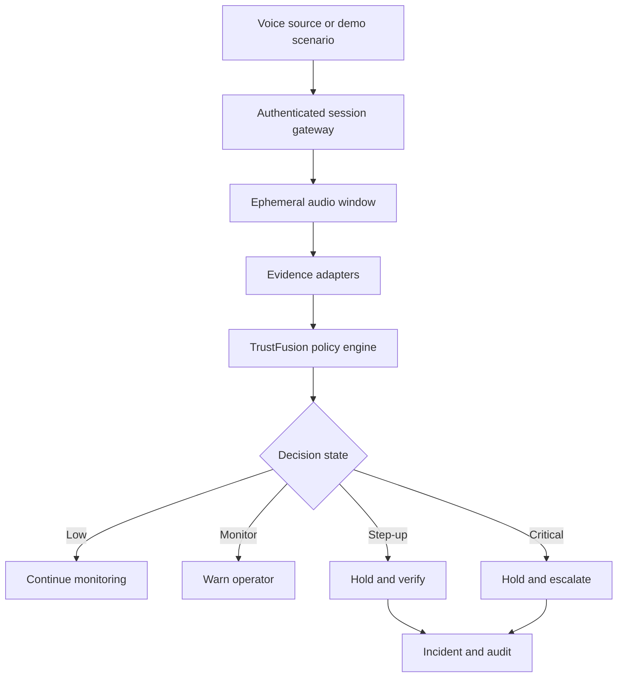
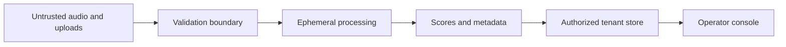

# Architecture

## Design goal

Phantom Vox is a modular monolith for a reliable hackathon demonstration and an incremental enterprise pilot. The architecture separates voice evidence from business decisions so a detector score alone never directly approves or blocks a transaction.

## Runtime components

| Component | Responsibility |
|---|---|
| React console | Eight role-oriented workspaces, WebSocket updates, actions, and evidence explanation |
| FastAPI gateway | Authentication, validation, tenant scope, REST, WebSocket, and OpenAPI |
| Session service | Per-call state, audio windows, evidence, and decisions |
| RawNetLite adapter | Optional lazy-loaded synthetic-speech evidence from the included checkpoint |
| TrustFusion | Quality gate, evidence coverage, weighted fusion, recency, consecutive windows, and hysteresis |
| Prevention service | Transaction hold, verification, incident, escalation, and resolution state |
| Policy service | Database-backed thresholds, versions, dry runs, publication, and retention rules |
| Audit service | Canonical event serialization, SHA-256 hash chaining, and integrity verification |
| SQLAlchemy store | SQLite for local use and PostgreSQL through `DATABASE_URL` for a pilot |

## Trust boundary

- Audio is untrusted input.
- Uploads are extension and size checked.
- Temporary files are deleted in a `finally` block.
- No raw audio is retained by default.
- API and WebSocket access require signed tokens.
- Tenant filters are applied to resource queries.
- Sensitive actions require an authorized role and create audit events.

## Decision semantics

Evidence modules return a score, quality, availability flag, explanation, and version. Missing evidence is not treated as zero risk.

The included TrustFusion implementation is a **policy baseline**, not a calibrated statistical model. It:

1. Applies a channel-quality gate.
2. Checks that enough weighted evidence is available.
3. Computes a normalized evidence score.
4. Gives more weight to the current and recent windows.
5. Requires consecutive high-risk windows for a critical action.
6. Uses hysteresis to prevent state flicker.
7. Emits uncertainty and abstention outcomes.

## Deployment progression

1. Local judge demo with SQLite and seeded scenarios.
2. Shadow pilot with real call streams and no automatic action.
3. Agent-assist pilot with warnings and secure verification.
4. Controlled transaction hold for validated policies.
5. PostgreSQL, enterprise identity, regional deployment, monitoring, and high availability.

## Scaling path

The local release uses one process and an in-process WebSocket hub. A multi-instance deployment must move session events to Redis or another managed broker, use PostgreSQL, add durable job coordination, and route WebSocket clients with shared state. This work is intentionally not disguised as complete in the current package.
